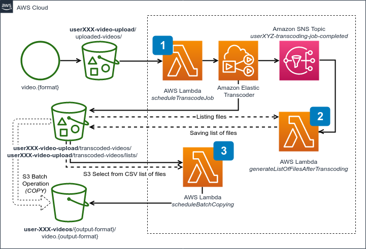

# *Amazon S3 in Practice*

In this set of assignments, we will work with several *Amazon S3 APIs* and features that are related to the capabilities of the *Object Storage*. This i

## Serverless Framework

In this assignment, to save some time and do not bother for servers and networking, we will use *AWS Lambda* and *serverless approach*. To do that, we will leverage a 3rd party tool called *Serverless Framework*. It allows for building the whole *serverless application*, including provisioning the necessary *cloud resources* in an automated and codified way.

We will build a *Serverless Video Transcoding* pipeline.

Here is the architecture of our application:



### Operations

A set of useful commands.

Building *Java* application:

```bash
./gradlew build
```

Deploying *serverless application*:

```bash
# Deploy all functions and related AWS resources:
sls deploy

# ... or redeploying just one function:
sls deploy -f <name_of_the_function_from_serverless.yml_file>
```

Removing and starting from scratch:

```bash
sls remove
```

Using `sls` requires a proper setup of `aws-cli` that we did at the beginning. If you are using different `aws-cli` profile name than a `default` (in other words: you have set up `aws-cli` on your machines before the workshop) you need to set it via the following environment variables:

```bash
export AWS_DEFAULT_PROFILE=<your_profile_name>
export AWS_PROFILE=<your_profile_name>
```

Additionally please set a default region to the *Ireland*:

```bash
export AWS_DEFAULT_REGION=eu-west-1
export AWS_REGION=eu-west-1
```

## Tasks

In the `./java/` directory look for source code. You will helpful comments and links that allow you to go step by step on your own.

## Problems?

1. If you are looking for logs, you can look inside *Amazon CloudWatch* service.
    - Either directly or via *AWS Lambda* console and selecting a *function* you want to inspect and heading into *Monitoring* tab.
    - Additionally you can do it with a `sls` command `sls logs -f <name_of_function_from_serverless.yml_file>`.
2. Closely inspect the *environment variables* and numbers across the *S3 buckets* and other resources.

### Exercise 1: S3 Event Notifications and Metadata

#### Description

In a first task, you need to set an *S3 Event Notification* correctly inside a `serverless.yml` file and inserting the proper name of the *S3 Event*.

#### Task

Additionally, please fill out the blanks in the *Java* code inside `ScheduleTranscodeJob.java` file related to *S3 Metadata* call right after scheduling an *Elastic Transcoder Job*.

After solving this, please deploy it, and wait until all resources are created. Then we need to manually click through the creation process of *Amazon Elastic Transcoder* pipeline (it does not support *AWS CloudFormation*), and after obtaining the pipeline ID, we enter it to the `serverless.yml` file. Now we are ready to deploy again and test.

#### Result

After that step, you should successfully schedule jobs in the *Elastic Transcoder* pipeline after uploading a video file. You can find sample files in the [samples](./samples) directory. When a job is scheduled, a newly uploaded file should also have an *S3 metadata* entry with the returned *Job ID*.

### Exercise 2: S3 API

#### Description

First function schedules transcoding, which lands in the same bucket, but in a different directory. As we not only request for the new video formats but also we are generating thumbnails - we need to list all created files into a *CSV* file. When *Elastic Transcoder* finishes the transcoding sends a notification via *SNS topic* - and that is triggering *lambda function* that is affected by the task no. 2.

#### Task

Please fill out the blanks annotated as *2nd task*, which are related to the usage of *S3 API*.

#### Result

When scheduled job from previous step finishes, you should see a *CSV file* with the complete list of files produced from the transcoding job. It will be placed inside the same bucket. Still, a different directory (configured via environment variables), inspect that file and make sure that it contains proper columns, where one is a key name (*filename*).

### Exercise 3: S3 Select and S3 Batch Operations

#### Description

Now it's a time to clean up those files and move it to a different bucket. We will use *S3 Batch Operations API* for that. To complete this, we need to create a manifest file, and that is why we needed the *CSV* from a previous step.

#### Task

Your task here is to fill out the blanks related with *S3 Select* call to the *CSV* file and selecting only the proper column, plus completing the *S3 Batch Operation* job definition based on the collected information.

#### Result

As a result of your, lambda should be invoked when a new *CSV file* lands in a proper directory. Right after that, you should see a new *S3 Batch Operation* job to be scheduled, which eventually copies the necessary files to the separate bucket, configured with the use of *environment variables*.

## License

- [MIT](LICENSE.md)

## Authors

- [Wojciech Gawroński (afronski) - AWS Gentleman](https://github.com/afronski)
